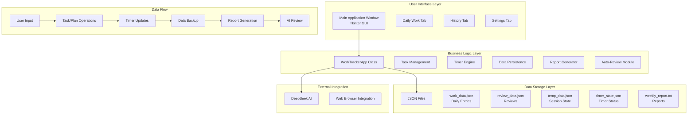

# 📋 Daily Work Tracker

**A comprehensive desktop application for daily task management, work hour tracking, and AI-powered productivity analysis.**

---

## 📋 About This Repository

This repository contains the **Daily Work Tracker** application - a comprehensive desktop tool for professionals to manage daily tasks, track work hours, and generate AI-powered productivity reports.

**Developer**: Abdelrhman Hamed

---

## 🏗️ System Architecture



---

## 🚀 Features

### Core Features
- **📋 Task Management**: Add, complete, and delete tasks with real-time updates
- **📝 Plan Points**: Track daily objectives and goals
- **⏱️ Background Timer**: Timer continues running even when app is closed
- **📊 History View**: Complete history of all completed tasks and sessions
- **📈 Statistics**: View productivity metrics and trends
- **📝 Daily Notes**: Keep notes for each day

### Enhanced Features (v2.1)
- **Background Timer**: Timer persists across app restarts
- **Timer State Save**: Automatic saving of timer state
- **Pause/Resume**: Control timer as needed
- **Logout Function**: Safely end sessions with data preservation
- **Auto-Save Notes**: Automatic saving of daily notes
- **DeepSeek Integration**: AI-powered review of weekly reports

### Additional Tools
- **End of Day Review**: Comprehensive daily review with prompts
- **Weekly Reports**: Generate detailed weekly summaries
- **Data Backup**: Create backups of all data
- **Data Management**: Clear or export data as needed

---

## 🚀 How to Install on Your PC

### Step 1: Install Python

#### Windows
1. Download Python from [python.org](https://www.python.org/downloads/)
2. Run the installer
3. **⚠️ IMPORTANT**: Check ✅ **"Add Python to PATH"**
4. Click **"Install Now"**
5. Verify installation:
   ```cmd
   python --version
   ```

#### Linux (Ubuntu/Debian)
```bash
sudo apt update
sudo apt install python3 python3-pip
python3 --version
```

#### macOS
```bash
brew install python3
python3 --version
```

---

### Step 2: Clone or Download Repository

#### Option A: Clone with Git
```bash
git clone https://github.com/Abdelrhman2371999/Daily-Work-Tracker.git
cd Daily-Work-Tracker
```

#### Option B: Download ZIP
1. Go to: https://github.com/Abdelrhman2371999/Daily-Work-Tracker
2. Click **"Code"** → **"Download ZIP"**
3. Extract the ZIP file
4. Open the folder

---

### Step 3: Create Application Directory

```bash
# Windows
mkdir "D:\Python Automation\WorkTracker"
cd "D:\Python Automation\WorkTracker"

# Linux/macOS
mkdir ~/WorkTracker
cd ~/WorkTracker
```

---

### Step 4: Install Dependencies

```bash
# Install required packages
pip install pyperclip

# If you have issues, try:
python -m pip install pyperclip

# For Linux/macOS:
pip3 install pyperclip
```

---

### Step 5: Create the Application File

1. Create a new file called `work_tracker.py`
2. Copy the full application code into the file
3. Save the file

#### Quick Creation (Windows)
```powershell
# In PowerShell
New-Item work_tracker.py
# Then open and paste the code
```

#### Quick Creation (Linux/macOS)
```bash
touch work_tracker.py
# Then open and paste the code
```

---

### Step 6: Run the Application

```bash
# Windows
python work_tracker.py

# Linux/macOS
python3 work_tracker.py
```

---

### Step 7: Create Desktop Shortcut (Windows)

#### Option A: Simple Shortcut
1. Right-click on desktop
2. Select **New → Shortcut**
3. Location: 
   ```
   python.exe "D:\Python Automation\WorkTracker\work_tracker.py"
   ```
4. Name: `Daily Work Tracker`
5. Click **Finish**

#### Option B: Batch File
1. Create `start_tracker.bat` file
2. Add this content:
   ```batch
   @echo off
   cd "D:\Python Automation\WorkTracker"
   python work_tracker.py
   pause
   ```
3. Create shortcut to this .bat file

---

### Step 8: Setup Auto-Start (Optional)

#### Method 1: Startup Folder (Simple)
```bash
# Windows
# Press Win + R
# Type: shell:startup
# Press Enter
# Create shortcut to your application
```

#### Method 2: Task Scheduler (Recommended)
1. Open **Task Scheduler** (Start Menu → Search)
2. Click **"Create Basic Task"**
3. **Name**: `Daily Work Tracker`
4. **Trigger**: Daily at 10:00 AM
5. **Action**: Start a program
6. **Program**: `python.exe`
7. **Arguments**: 
   ```
   "D:\Python Automation\WorkTracker\work_tracker.py"
   ```
8. **Start in**: `D:\Python Automation\WorkTracker`
9. Check ✅ **"Run whether user is logged on or not"**
10. Click **Finish**

#### Method 3: Linux Auto-Start
```bash
# Create .desktop file
nano ~/.config/autostart/worktracker.desktop

# Add content:
[Desktop Entry]
Type=Application
Name=Daily Work Tracker
Exec=python3 /home/username/WorkTracker/work_tracker.py
Hidden=false
NoDisplay=false
X-GNOME-Autostart-enabled=true
```

---

## 📁 File Structure After Installation

```
D:\Python Automation\WorkTracker\
├── work_tracker.py          # Main application
├── work_data.json           # Daily entries (auto-created)
│   └── entries: [
│       {
│           "date": "2026-01-01",
│           "tasks": [...],
│           "plan_items": [...],
│           "hours_worked": 8.5,
│           "notes": "Daily notes"
│       }
│   ]
├── review_data.json         # Reviews (auto-created)
│   └── reviews: [
│       {
│           "date": "2026-01-01",
│           "entry": {...},
│           "review_answers": "..."
│       }
│   ]
├── temp_data.json           # Session state (auto-created)
│   └── {
│       "tasks": [...],
│       "plan_items": [...],
│       "login_time": "09:00",
│       "notes": "...",
│       "is_tracking": true,
│       "elapsed_seconds": 3600
│   }
├── timer_state.json         # Timer state (auto-created)
│   └── {
│       "is_tracking": true,
│       "start_time": "2026-01-01T09:00:00",
│       "elapsed_seconds": 3600,
│       "date": "2026-01-01"
│   }
├── weekly_report.txt        # Reports (auto-created)
└── backups\                 # Backups (auto-created)
    ├── backup_20260101_120000\
    ├── backup_20260102_120000\
    └── ...
```

---

## 🎯 Installation Checklist

- [ ] Python 3.7+ installed
- [ ] Python added to PATH
- [ ] Repository cloned or downloaded
- [ ] `pyperclip` installed: `pip install pyperclip`
- [ ] Application folder created
- [ ] `work_tracker.py` file created
- [ ] Code pasted and saved
- [ ] Application tested: `python work_tracker.py`
- [ ] Desktop shortcut created
- [ ] Auto-start configured (optional)

---

## 🐛 Common Installation Issues

| Issue | Solution |
|-------|----------|
| **"python not recognized"** | Reinstall Python → Check ✅ "Add to PATH" |
| **"pip not found"** | `python -m ensurepip --upgrade` |
| **"ModuleNotFoundError"** | `pip install pyperclip` |
| **Permission denied** | Run terminal as administrator |
| **File not found** | Check you're in correct directory |
| **Can't create folders** | Check write permissions |
| **Timer not persisting** | Check timer_state.json creation |

---

## 🔧 System Requirements

| Component | Minimum | Recommended |
|-----------|---------|-------------|
| **OS** | Windows 10, Linux, macOS | Latest version |
| **Python** | 3.7+ | 3.10+ |
| **RAM** | 2GB | 4GB+ |
| **Storage** | 50MB | 1GB |
| **Display** | 1366x768 | 1920x1080 |

---

## 📦 Dependencies

### Required
```bash
# Python Standard Library (Already installed)
tkinter
json
datetime
pathlib
shutil
webbrowser
os

# External (Install with pip)
pyperclip  # Clipboard management
```

### Installation Command
```bash
pip install pyperclip
```

---

## 🚀 Quick Start Commands

```bash
# Windows
cd "D:\Python Automation\WorkTracker"
python work_tracker.py

# Linux/macOS
cd ~/WorkTracker
python3 work_tracker.py

# Install dependencies
pip install pyperclip

# Create backup (in app)
Settings → Create Backup

# Clear data (in app)
Settings → Clear All Data
```

---

## 🌐 Quick Links

- **Repository**: [github.com/Abdelrhman2371999/Daily-Work-Tracker](https://github.com/Abdelrhman2371999/Daily-Work-Tracker)
- **Issues**: [github.com/Abdelrhman2371999/Daily-Work-Tracker/issues](https://github.com/Abdelrhman2371999/Daily-Work-Tracker/issues)
- **Python**: [python.org](https://www.python.org/)

---

## 📞 Contact & Support

- **Email**: abdelrhmanhamedmousaa@gmail.com
- **LinkedIn**: linkedin.com/in/abdelrhmanhamed
- **GitHub**: github.com/Abdelrhman2371999

---

## 📝 License

© 2026 **Abdelrhman Hamed** - All Rights Reserved

---

**✨ Built with ❤️ for better productivity**

**© 2026 Abdelrhman Hamed - All Rights Reserved**
